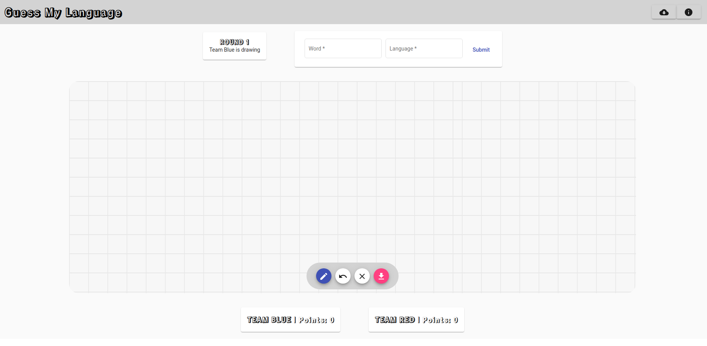

# Guess My Language
A dataset labelling game, developed with Angular and Flask.

### Dependencies
* Angular 12
* Node.js 14.17.5
* npm 7.21.1
* python 3.9.6
* flask 2.01

### Launch the application
First of all, launch the docker container for the db:

`docker run --name my-app-db -p 5432:5432 -e POSTGRES_DB=handwriting -e POSTGRES_PASSWORD=gml123 -d postgres`
`cd backend`
`run ./bootstrap.sh &`

Then, to launch the app on localhost:
`cd guessmylanguage`
`ng serve --open`
 
 ### Acknowledgements
Luleå University of Technology
SSDA2021
 
 ### Screenshot
 
 

